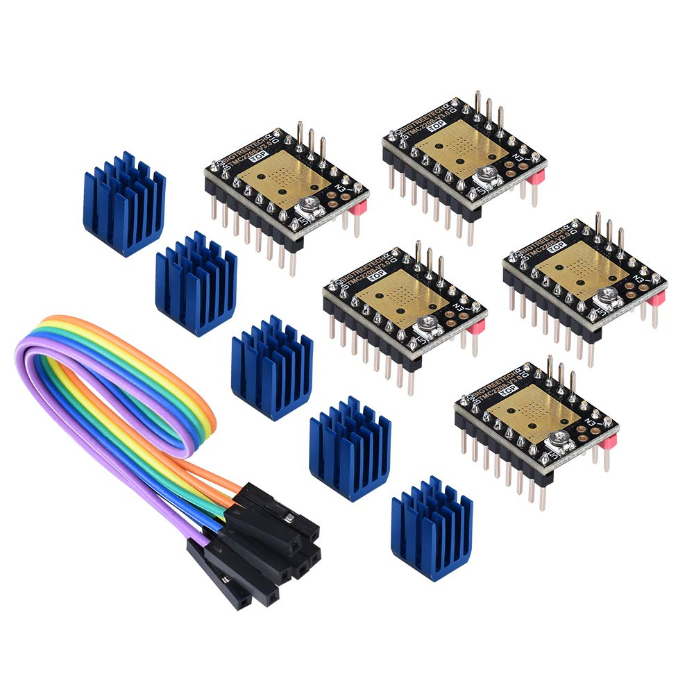
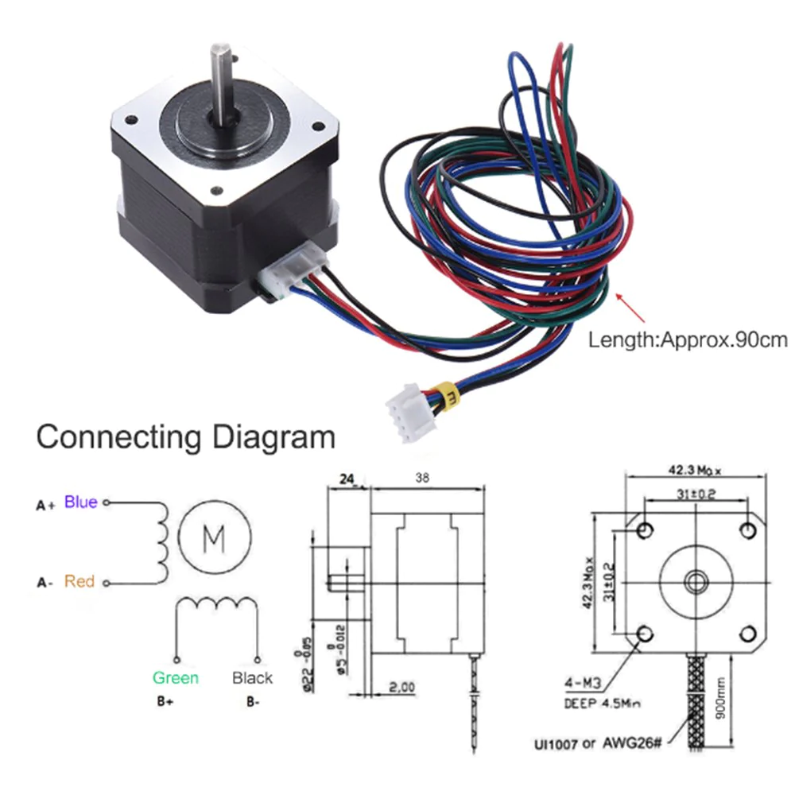

# CNC (Computer Numerical Control)

A general repository for learning and planning the development of CNC machines using a range of off the shelf and custom electronic and software solutions.

## Electronics

### Arduino UNO

### V3 CNC Shield for Arduino UNO

Originally purchased October 2020 from Amazon.

[HiLetgo 2pcs A4988 V3 Engraver Drive Shield 3D Printer CNC Drive Expansion Board for Arduino 3D Printer CNC](https://www.amazon.com/dp/B01D2HL9T8?ref_=ppx_hzsearch_conn_dt_b_fed_asin_title_1)

<!--  -->

The original development blog for the CNC shield can be found [here](https://blog.protoneer.co.nz/arduino-cnc-shield/).

Some basic code can be found 
[here](https://www.aranacorp.com/en/using-an-arduino-cnc-shield-v3/). I 
suggest using this code only to identify the pins on the CNC shield and 
inputting those pin values into your own script, built from the TMC2208 
examples.

A better hardware explanation of the CNC shield can be found 
[here](https://www.zyltech.com/arduino-cnc-shield-instructions/).

### TMC2208 Stepper Motor Driver

Originally purchased October 2020 from Amazon.

[TMC2208 V3.0 Stepper Motor Driver Module with Heat Sink Have UART Mode Compatible with Ramps1.4 or MKS Board SKR V1.3 for 3D Printers(Pack of 5pcs) (UART)](https://www.amazon.com/dp/B07RTBG8KK?ref_=ppx_hzsearch_conn_dt_b_fed_asin_title_2)

### Stepper Motor Cable

Originally purchased October 2020 from Amazon.

[YOTINO Bipolar Stepper Motor Cable,4Pcs x 1000mm Long XH2.54 4pin to 6pin NEMA 17 Extended Connector Cable for RepRap 3D Printer CNC Machines](https://www.amazon.com/dp/B07CBV8DVZ?ref_=ppx_hzsearch_conn_dt_b_fed_asin_title_2)

### Stepper Motor

Anet Stepper Motor 42SHDC3025-24B

The stepper motor was salvaged from Jeff's original ALUNAR Anet A8 purchased in May 2017 from Amazon. The motor is known to have a non-standard wiring pinout and cannot be plugged directly into the V3 CNC Shield using the stepper motor cable.

**Figure XX**: Anet stepper motor 42SHDC3025-24B with wiring diagram.

| Config | A+ | A- | B+ | B- |
| ----------- | ----------- | ----------- | ----------- | ----------- |
| Default (Figure XX) | Blue | Red | Green | Black |
| Aftermarket (YOTINO Stepper Motor Cable) | Black | Red | Green | Blue |

**Table 1**: Anet stepper motor 42SHDC3025-24B with aftermarket stepper motor cable wiring table.

Refer to both the image and table above for the specific wiring for the Anet stepper. If you're using a different stepper motor, be sure to check its specific wiring diagram before connecting it to the CNC Shield.

## Wiring

1. Install the CNC Shield on top of the Arduino UNO.
1. Install the TMC2208 into the CNC Shield. Orient the TMC2208 such that the enable pin ("EN") on the driver matches the enable pin ("EN") on the CNC Shield.
1. Install the heat sink on the TMC2208 if it is not already installed.
1. Refer to Table 1. With the CNC Shield oriented upright, so the text on the board is legible, connect the stepper motor wires to CNC Shield in the order A+, A-, B+, B- following the configuration of the aftermarket cable. This will likely require additional jumpers or modifications to the existing cable, as the order will likely be wrong. 

**Note to Self:** I removed the existing 4-slot dupont connector on the cable and used my 1-slot dupont connectors to separate the cable into four individual wires. This way, I can make my wiring connections as desired.

## Software

### Verify Board and Stepper Wiring

Script: `TMC2208 with V3 CNC Shield/TMC2208_Example/TMC2208_Example.ino`

The TMC2208 driver has a library within the Arduino IDE with provided examples. Version 0.2.5 is latest at time of 
this README. The INO file `TMC2208_Example.ino` is a modified version of the example code from the TMC2208 Arduino Library.

For this file, connect your stepper motor and stepper driver to the Y-Axis of the CNC Shield.

### GRBL

https://github.com/grbl

### Compiling GRBL

[GRBL Wiki Pages](https://github.com/grbl/grbl/wiki/_pages)

### GRBL Setup Guide for Windows

[Quick GRBL setup guide for Windows (Arduino G-Code Interpreter)](https://blog.protoneer.co.nz/quick-grbl-setup-guide-for-windows-arduino-g-code-interpreter/)

### GRBL Arduino Library

[GRBL Arduino Library – Use the Arduino IDE to flash GRBL directly to your Arduino](https://blog.protoneer.co.nz/grbl-arduino-library/)

## Control

### G-Code Sender

[gSender](https://resources.sienci.com/view/gs-installation/)